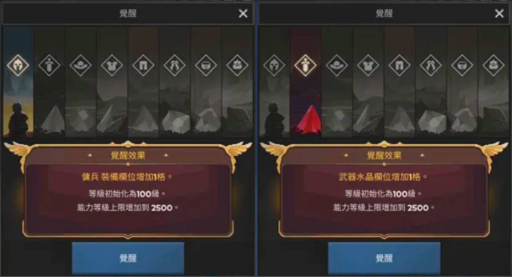
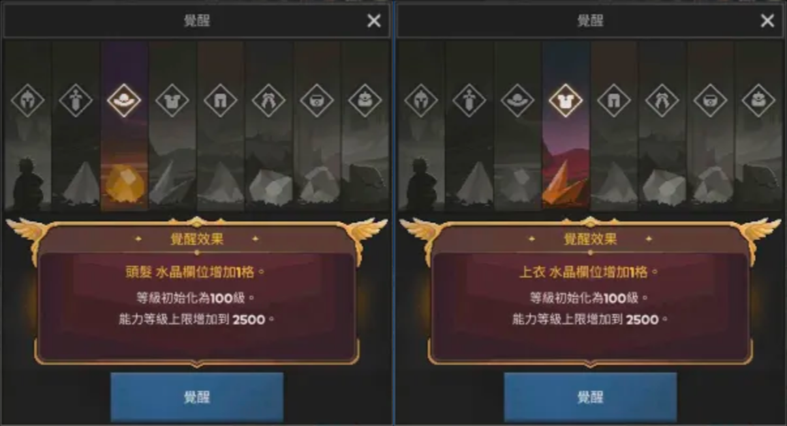
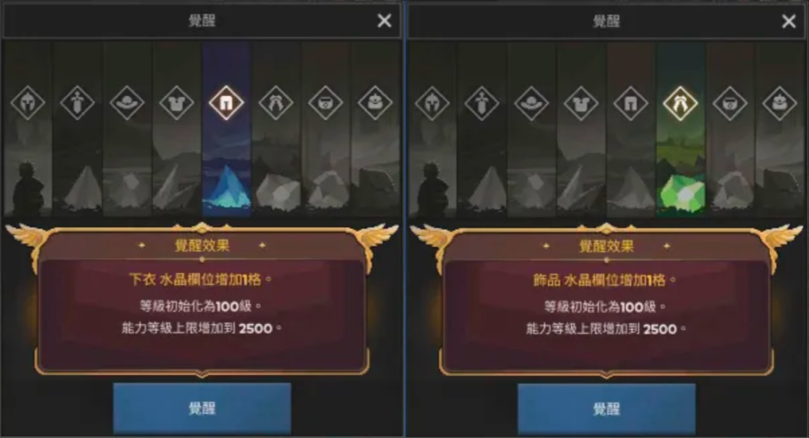
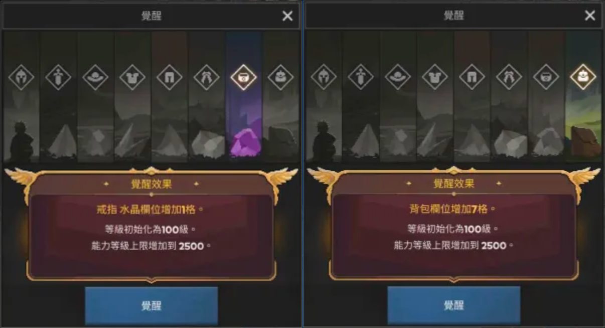

## 覺醒系統

### 條件

當 Lv130 & 能力（ab）到 **600 等** 時，可以開啟 **覺醒系統**

### 覺醒

1. 請選擇 **「傭兵 裝備欄位增加 1 格」** 完成覺醒 1

   > 📌 此時覺醒就暫時不再提升！！！

2. 接著存能力到 3300 ~ 3400 等，再一次覺醒到 8

   > 穩一點 3400 ~ 3400 再覺醒到 8  
   > 如果 3300 就覺醒，可以靠每次 Lv100 ~ Lv130 的過程提升能力，但不保證能穩定到覺醒 8

- 每次覺醒，角色等級會回到 Lv100
- 覺醒 1 的能力上限是 2500，這邊指的是 2500 之後不能再提升攻擊、防禦，但還是可以存到 3300！

### 覺醒表

| 覺醒 | 角色等級 | 所需能力 |
| :--: | :------: | :------: |
|  1   |   130    |   600    |
|  2   |   130    |  1,000   |
|  3   |   130    |  1,400   |
|  4   |   130    |  1,800   |
|  5   |   130    |  2,200   |
|  6   |   130    |  2,600   |
|  7   |   130    |  3,000   |
|  8   |   130    |  3,400   |

### 覺醒效果

能力等級上限每次覺醒後會提升

