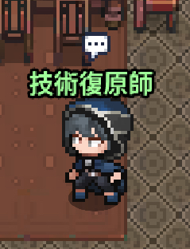

## 前言

這邊在細分前期（0 轉）和後期（1~8 轉），前期一開始什麼都沒有，大概要花個 5 天左右的時間，等到第 1 次轉職後就會輕鬆許多！

## 開局

1. 建議選有大多數中文玩家的**芬里爾**伺服器
2. 以 Google 帳號創建

## 前期（0 轉）

跟著主線走有任務就接，有時候會遇到主線任務和支線任務打的**怪物重疊**可以同時解掉任務

### Lv 0 ~ Lv 70

Lv 5  
選擇職業，法師、馴服、盜賊、戰士 4 選 1

> 建議先選 **馴服**

 

Lv 25  
開放傭兵

> 這裡預留每日該買東西的寶石後，All In 抽到召喚等級 5 為止

 

Lv 60  
找 **精靈神官** 轉生，依照前面選得職業，會分成 2 個職業分支給你選擇

> 舉例：馴服 => 荷米斯 or 君主

> 注意：進化時，請不要點到轉職，不然會從 Lv 0 重新練 😭

 

~ Lv 70  
如果任務已經解完了，可以到 **遺蹟探險家** 掛機

***

### Lv 70 ~ Lv 100

- 一樣解任務，解到主線、支線任務等級 **Lv.100** 就可以暫停
- 每天 18:00 是 Hot Time 經驗加倍時間，  
   建議暫停任務進度，轉移至 **佈雷吉船長 => 下雪的強韌** 掛機

   > 只選擇關卡名稱有下雪的強韌，其他效益不穩定

   { width="20%" }

 

Lv 80  
找 **精靈神官** 依你選的職業繼續進化(X)

> 舉例：馴服 => 君主 => 精靈師

> 注意：進化時，請不要點到轉職，不然會從 0 等重新練 😭

 

~ Lv 100  
繼續掛船長，直到 Lv 100

 

Lv 100

1. 到 **克萊伊村莊** 找 **鐵匠** 做一套 Lv100 的 裝備 <!-- [裝備](/item) -->
2. 到 **聯盟 => 聯盟領地**，進去最上方的城堡找圖示是鐵匠的 NPC，把武器品質敲成 **堅固**
3. 到 **伊弗利特村莊** 找副職業公會長，解這個任務後，就可以開 副職業 了 <!-- [副職業](/subjob) -->
4. 回去找 **精靈神官** 選 **轉職**

 
這樣就完成 1 次轉職的流程了！

## 後期（1 ~ 8 轉）

- 重複前面的流程，沒有任務時回去**佈雷吉船長**掛機
- 一樣到 Lv 100 轉生後再轉職，直到練完 8 轉 
    > 最後一次 Lv 100 時，建議去 **克萊伊村** 找賢者那邊的 **技術復原師** 看有沒有漏掉的技能

    { width="20%" }

   

🔍 拋棄 **佈雷吉船長** 去找 **次元旅行者** 的時機

- 位置：移動 => 內容 => 狩獵場 => 次元旅行者
- 關卡：疑問之次元 - 上
- 條件：
  1. 每分鐘 4 隻怪（也可以兩邊比較看看）
  2. 和其他人組隊可直接打
