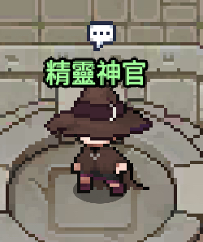
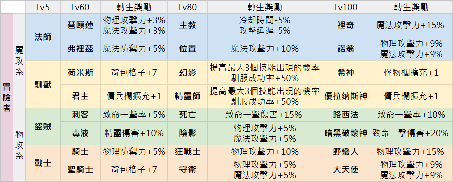
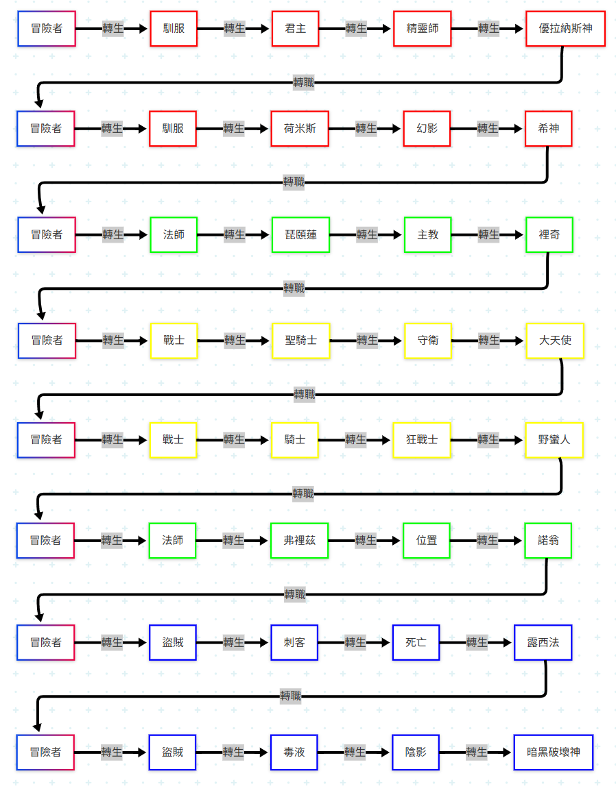

# 職業

## 說明

- 法師、馴服、盜賊、戰士 4 種職業，每個職業再分成 2 條分支職業
- 等級達到條件可進行轉職，且之前練過的轉生獎勵也會保留，但轉職後***等級需要重新從 Lv0 開始練***

✔ 建議選擇一個路線轉生到 4 轉，最後在轉職選擇下一個職業

## 精靈神官

{ width="30%" }

- 8 轉前期你最常遇到的 NPC，不管是 **轉生** or **轉職** 都要找他
- 也是初期最先碰到問題的地方 😭
- 到 亞特蘭提斯，水之城 NPC 會變成 **亞特蘭提斯大祭司**

### 精靈神官的文字測驗 💡

**轉生**：職業 1 ~ 4 轉（馴服 -> 君主 -> 精靈師 -> 優拉納斯神）  
 **轉職**：轉職重新回到冒險者，且 Lv 0

## 職業表

## 推薦流程

{ width="90%" }

- 由於前期需要靠傭兵打怪，所以建議從馴服開始練！

## 懶人包

1. 注意：找精靈神官時，不要搞錯 **轉生**、**轉職** 唷！
2. 查看職業表選擇你想要練的流程，建議以職業表上一列的職業來轉生，到 Lv100 轉生完再轉職
3. 如果不想思考也可以直接參考 **推薦流程**
