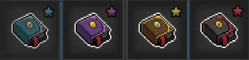

# 技能書

元素 2D 需要經過 8 轉的流程，所以所有的技能都可以學習的！

## 2 種技能書

分成 2 種不同樣式的技能書

### 一般技能書
- 圖示躺著
- 分成 Lv60 以下（藍）、Lv60, Lv70（紫）、 Lv80, Lv90（金）、Lv100 以上（紅）

{ width="60%" }

### 職業技能書：
- 圖示立著，中間有職業圖案
- 分成 Lv60（藍）、Lv80（紫），Lv90（金）、Lv130（紅）

{ width="20%"}

## 學習條件

1. 已經走過技能書上的職業
2. 等級超過技能書上的等級

## 獲得方法

克萊伊村莊 - 賢者
{ width="30%"}

- 商店 => 買技能書
- 借書 => 查看符文

### 一般技能書

1. 路上打怪獲取
2. 在 **克萊伊村莊** 的 **賢者** 那裡可以買，學習過的技能就不能再購買

### 職業技能書

1. 60 等（藍）、80 等（紫）的職業技能書可以從路上打怪獲取
2. 在 **克萊伊村莊** 的 **賢者** 可以用換的
   - 藍書 20 本可以換紫書
   - 紫書 20 本可以換金書 0 階

> 1. 藍書、紫書要存著換金書
> 2. 技能書自動販售功能 **不會** 將職業技能書賣出

### 任務技能

- 除了基礎職業，其餘每個職業都有兩個任務技能，會在可成為該職業的 5、15 等後開放支線  
  EX：君主會在 65、75 開放支線，而希神會在 105、115 開放支線
- 自動販售不會販售任務技能書

## 通用技能配置參考

- 技能配置僅提供參考，請盟友自由搭配或抄聯盟內大佬的技能配置
- 下面提供一般刷怪鍊等用的配置，根據不同關卡技能配置會有所不同

### 8 轉前\_地圖練功

### 8 轉後\_地圖練功

## 補充

### 金色職業技能書

- 每種職業各有 2 種不同的金職業技能書，一種為可以升級的攻擊技能，另一種是 buff 技能，但 buff 技能不能升級
- 升級的職業技能左下角的圖示也會有所不同，0 階（無）、1 階（藍）、2 階（紫）、3 階（金）

### 金色職業技能書升級

20 本紫書 + 10,000 知識碎片 => 金 0 階  
2 本金 0 階 + 4 龍爪 => 金 1 階  
3 本金 1 階 + 4 龍爪 => 金 2 階  
4 本金 2 階 + 4 龍爪 => 金 3 階

### 金色職業技能書效果

除了 0 階職業技能書以外，每階的技能會有不同的效果

### 紅色職業技能書

- 要開啟 4 階技能的條件為學習所有職業 3 階技能，在 冒險 > 業績 有一個**技能習得達成** 可以直接獲得第一本 4 階技能書
- 之後一樣找賢者，以 2 本金 3 階 + 4 龍爪換紅色 4 階技能書
