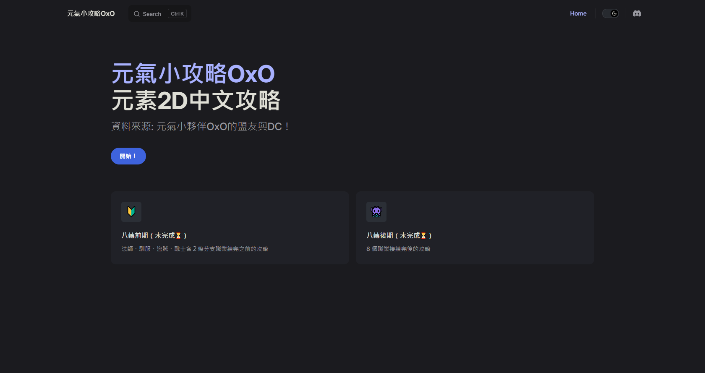
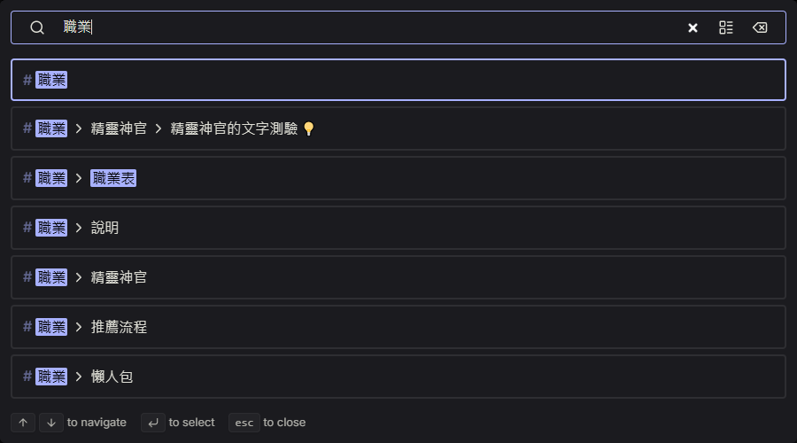

# 歡迎來到 **元氣小攻略OxO** 

#### 希望這個網站可以幫到每個玩元素2D的大家
#### 這是我第一次做攻略網站，雖然大部份是搬運 元氣小夥伴OxO 的 DC
#### 如果有錯在麻煩通知我（哇哩勒哇），也歡迎內容補充！

## 操作、說明

{ width="100%" }

- 這個靜態網站適用 VitePress 開發，並發佈到 Github Pages
- 首頁下方有框框可以跳轉到練等推薦流程的 [八轉前期](/beginner) 與 八轉後期
- 左上角標題右邊的搜尋功能，可以搜尋整個網頁的文字內容    
    
- 右上角有 DC 連結（目前是連到 Discord 官網）
- DC 圖示左邊是可以調整深淺色模式的開關

## 更新日誌
#### 2025-06-05 元氣小攻略OxO 上線
#### 2025-06-07 建立 技能書
#### 2025-06-08 建立 八轉後期、邁向大佬、覺醒、大師等級